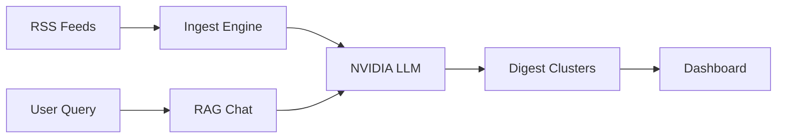
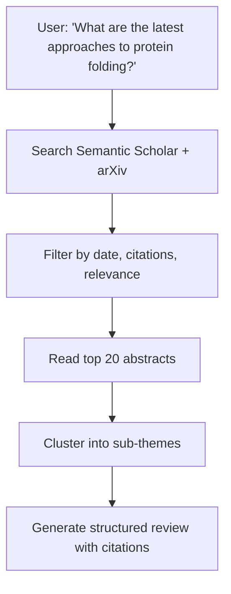
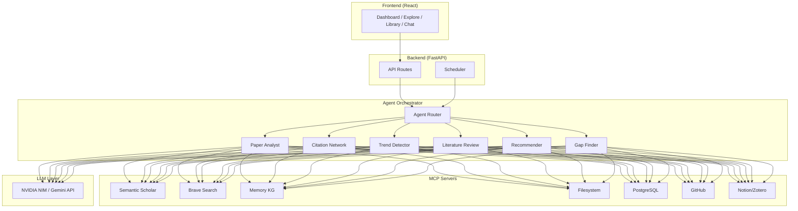

# A.R.I.A Expansion — MCP Tools & Agent Recommendations

## Current Architecture Recap



A.R.I.A currently ingests RSS feeds, generates LLM-powered digests, and offers a chat assistant. The expansion opportunities below are organized by **impact tier**.

---

## 🔧 MCP Tools (Model Context Protocol Servers)

MCP servers give your agents structured, real-time access to external data sources and services without writing custom API integrations.

### Tier 1 — High Impact (Add First)

#### 1. `@modelcontextprotocol/server-brave-search`
**Why**: Your Explore page currently uses mock data and a basic arXiv RSS fetch. Brave Search gives agents the ability to search the full web for papers, blog posts, research threads, and news — dramatically improving the Explore feed quality.

**Integration Point**: Explore page feed enrichment, Chat RAG context augmentation

```json
{
  "mcpServers": {
    "brave-search": {
      "command": "npx",
      "args": ["-y", "@modelcontextprotocol/server-brave-search"],
      "env": { "BRAVE_API_KEY": "your-key" }
    }
  }
}
```

---

#### 2. `@modelcontextprotocol/server-memory`
**Why**: A.R.I.A has no persistent knowledge graph. The Memory MCP creates a local knowledge graph of entities and relations that agents can read/write across sessions. This lets A.R.I.A *remember* the user's research interests, key authors they follow, topic connections, and paper relationships.

**Integration Point**: Chat personalization, digest relevance ranking, research interest tracking

```json
{
  "mcpServers": {
    "memory": {
      "command": "npx",
      "args": ["-y", "@modelcontextprotocol/server-memory"]
    }
  }
}
```

---

#### 3. Semantic Scholar MCP (Custom)
**Why**: arXiv RSS gives you titles and abstracts, but Semantic Scholar provides **citation graphs**, **influence scores**, **author profiles**, **reference/cited-by lists**, and **TLDR summaries**. This is the single most impactful data source for a research platform.

**Capabilities to Expose**:
- `search_papers` — full-text paper search with filters
- `get_paper_details` — citations, references, influence score, TLDR
- `get_author_profile` — h-index, publication history
- `get_citation_graph` — paper's citation network
- `get_recommendations` — "papers like this one"

**Integration Point**: Library enrichment, citation analysis, "Related Papers" feature, author pages

---

#### 4. `@modelcontextprotocol/server-filesystem`
**Why**: Your chat accepts file uploads (PDFs, code, text) but doesn't persist or process them beyond the session. A filesystem MCP lets agents read, write, and organize uploaded documents in a structured research workspace.

**Integration Point**: Chat PDF analysis, document-based RAG, export digests to files

---

### Tier 2 — Medium Impact (Add Next)

#### 5. `@modelcontextprotocol/server-postgres`
**Why**: You're on SQLite which limits concurrent access, full-text search, and scalability. A Postgres MCP gives agents direct query access to a production database with `pgvector` support for semantic search over paper embeddings.

**Integration Point**: Replace SQLite, enable vector similarity search for RAG, full-text search on digests

---

#### 6. Notion MCP (`@notionhq/notion-mcp-server`)
**Why**: Researchers live in Notion. Let users export digests, reading lists, and notes directly to their Notion workspace.

**Integration Point**: "Export to Notion" button on digests and library items

---

#### 7. Zotero MCP (Custom)
**Why**: Zotero is the most popular academic reference manager. Bidirectional sync lets users import their Zotero library into A.R.I.A and export A.R.I.A papers back to Zotero collections.

**Integration Point**: Library page import/export, automatic bibliography generation

---

#### 8. `@modelcontextprotocol/server-github`
**Why**: Many papers have companion code repos. GitHub MCP lets agents find and link repos to papers, check repo activity/stars, and pull README summaries.

**Integration Point**: Explore cards show "Has Code ✓", Library enrichment, Chat can browse paper repos

---

### Tier 3 — Nice to Have

#### 9. Slack/Discord MCP
**Why**: Research teams want digest delivery and paper sharing in their communication channels.

**Integration Point**: Scheduled digest delivery to channels, share-to-Slack/Discord button

---

#### 10. Google Calendar MCP
**Why**: Conference deadlines, paper submission dates, and seminar schedules are critical for researchers.

**Integration Point**: Dashboard "Upcoming Deadlines" widget, conference paper tracking

---

## 🤖 AI Agents

These are autonomous or semi-autonomous agents that use the MCP tools above and the NVIDIA LLM to perform complex multi-step research tasks.

### Core Research Agents

#### 1. 📄 Deep Paper Analyst Agent
**Purpose**: When a user saves a paper to their Library, this agent automatically generates a comprehensive analysis — not just a summary.

**Outputs**:
- Multi-section breakdown (Motivation → Method → Results → Limitations)
- Key contributions extracted as bullet points
- Methodology classification (empirical, theoretical, survey, etc.)
- Reproducibility assessment
- "So What?" — plain-language impact statement

**MCP Tools Used**: Semantic Scholar, Filesystem (for PDF parsing)

---

#### 2. 🔗 Citation Network Agent
**Purpose**: Builds and visualizes citation relationships between papers in the user's library.

**Outputs**:
- Interactive citation graph (D3.js force-directed graph)
- "Foundational Papers" — most-cited ancestors
- "Emerging Work" — recent papers citing the user's collection
- Citation velocity trends

**MCP Tools Used**: Semantic Scholar, Memory (to cache graph state)

**New UI**: Add a "Citation Map" tab to the Library page

---

#### 3. 📊 Research Trend Detector Agent
**Purpose**: Runs on a schedule (like your digest scheduler) to detect emerging topics, rising keywords, and breakout papers.

**Outputs**:
- Weekly "Trending in [field]" report
- Keyword frequency heatmaps over time
- "Breakout Papers" — new papers getting unusual citation velocity
- Comparison: "This week vs. last week" in your research areas

**MCP Tools Used**: Brave Search, Semantic Scholar, Memory

**New UI**: Replace mock data in Explore sidebar with real trending data

---

### Discovery Agents

#### 4. 🔍 Literature Review Agent
**Purpose**: Given a research question, autonomously performs a mini systematic review by searching, filtering, and synthesizing relevant papers.

**Workflow**:


**MCP Tools Used**: Semantic Scholar, Brave Search, Memory

**Trigger**: Chat command `/review [topic]` or dedicated UI panel

---

#### 5. 🧩 Research Gap Finder Agent
**Purpose**: Analyzes a body of work and identifies underexplored areas, contradictions, or open questions.

**Outputs**:
- "No one has studied X in the context of Y"
- "Papers A and B report conflicting findings on Z"
- Suggested research directions

**MCP Tools Used**: Semantic Scholar, Memory

---

#### 6. 📬 Paper Recommender Agent
**Purpose**: A personalized daily/weekly recommendation engine based on the user's reading history, saved papers, and stated interests.

**Algorithm**:
1. Build user interest profile from Library + Digest interactions (Memory MCP)
2. Fetch new papers from Semantic Scholar recommendations API
3. Score relevance using embedding similarity
4. Deliver as a "For You" section on the Dashboard

**MCP Tools Used**: Semantic Scholar, Memory, Brave Search

**New UI**: "Recommended for You" card grid on the Dashboard

---

### Collaboration Agents

#### 7. 👥 Collaborator Finder Agent
**Purpose**: Given a research topic or paper, finds potential collaborators by analyzing author networks, shared references, and complementary expertise.

**Outputs**:
- Author profiles with h-index, top papers, institutional affiliation
- "Collaboration Score" based on research overlap
- Shared references / co-citation analysis

**MCP Tools Used**: Semantic Scholar, GitHub (for code contributors)

---

#### 8. 📝 Auto-Annotator Agent
**Purpose**: When a PDF is uploaded to the Library, this agent automatically highlights key findings, extracts tables/figures, and generates margin notes.

**Outputs**:
- Extracted figures with captions
- Key statistics pulled from results sections
- Auto-generated highlights for rapid skimming
- Linked definitions for domain-specific terms

**MCP Tools Used**: Filesystem, Memory

---

## 🏗️ Suggested Architecture



## 📋 Recommended Implementation Order

| Phase | What to Add | Timeline |
|-------|-------------|----------|
| **Phase 1** | Semantic Scholar MCP + Memory MCP + Paper Recommender Agent | 1-2 weeks |
| **Phase 2** | Brave Search MCP + Trend Detector Agent + Literature Review Agent | 1-2 weeks |
| **Phase 3** | Citation Network Agent + Filesystem MCP + Deep Paper Analyst | 2-3 weeks |
| **Phase 4** | PostgreSQL migration + Notion/Zotero export + GitHub MCP | 2-3 weeks |
| **Phase 5** | Collaborator Finder + Auto-Annotator + Slack/Discord delivery | 2-3 weeks |

> [!TIP]
> **Start with Phase 1.** Semantic Scholar + Memory gives you the data foundation, and the Paper Recommender is the highest-value user-facing feature you can ship quickly.

> [!IMPORTANT]
> For the MCP server architecture, consider using **[`mcp-proxy`](https://github.com/nicholaschenai/mcp-proxy)** or **LangGraph** as your agent orchestration layer. This lets you define agents as nodes in a graph with tool-calling capabilities, rather than writing custom orchestration code for each agent.
